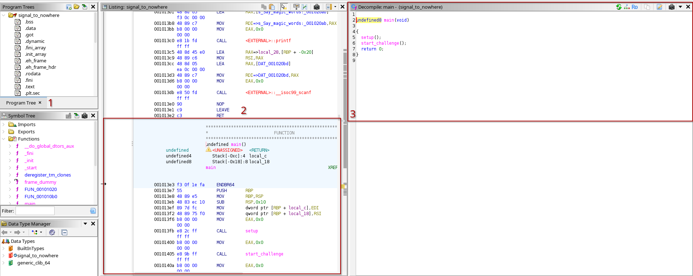
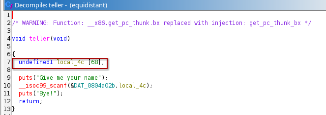
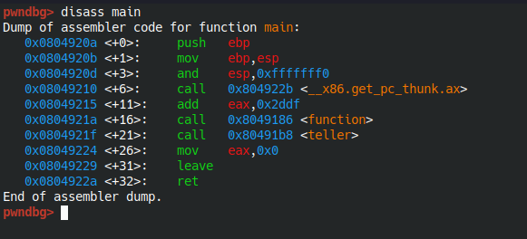
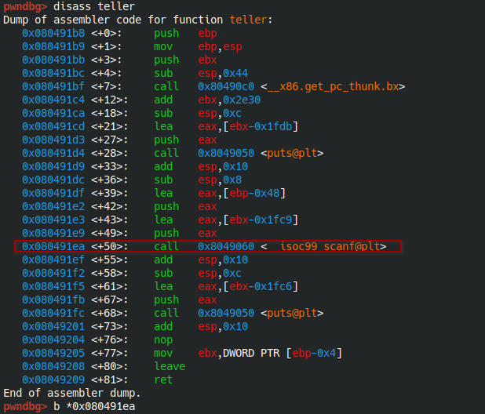

# Cheatsheet - Securitatea informatiei

Obs. Acest cheatsheet contine informatii cu privire la conceptele/instrumentele necesare pentru rezolvarea examenului de laborator pentru partea de **Binary Exploit**

## Requirements

 - masina virtuala de Linux
 - ghidra [**Download**](https://github.com/NationalSecurityAgency/ghidra)
 - gdb  (**sudo apt install gdb**)
 - checksec (**sudo apt install checksec**)
 - pwndbg - plugin de gdb ce faciliteaza procesul de debugging [**Downlad**](https://github.com/pwndbg/pwndbg)
 - biblioteca  pwntools (**pip3 install pwntools**)

## Ghidra - Tips and tricks

- Decompiler ce genereaza o varianta apropiata de codul sursa in format C pentru fisierul binar analizat


```
Legenda:
    1 - Symbol Tree -> Functions => Functiile definite in cadrul binarului
    2 - Varianta in cod de asamblare a zonei de cod analizata
    3 - Varianta decompilata in pseudo-code C
```

### Naming convention

- Un lucru foarte util pe care trebuie sa-l stim atunci cand lucram cu ghidra este ca variabilele locale din cadrul functiilor au o logica anume in denumire. [Vezi poza de mai jos]



Functia teller contine variabila locala **local_4c** care este un buffer cu dimensiunea 68. Denumirea de local_4c vine de la faptul ca adresa de inceput a bufferului se afla la distanta de **0x4c** (76 bytes) fata de adresa de return a functiei *teller*. Aceasta informatie ne ajuta in cazul in care exista o vulnerabilitate de tip buffer overflow deoarece ce stim ca pentru a ajunge sa suprascriem adresa de return trebuie sa completam mai intai cu 76 de bytes inputul.

Aplicand cele discutate in paragraful anterior payloadul pentru suprascriere poate arata in felul urmator.
```py
payload = 76 * b'A' + <new_return_address>
```
**Atentie!** Exemplul este in scop demonstrativ, nu am luat in calcul mecanismele de securitate cum ar fi: canary, PIE, NX samd

## 2. Checksec

**Checksec** - utilitar de analiza statica care identifica mecanismele de securitate folosite de binar. Recomand folosirea tool-ului ca prim pas in momentul in care incepeti o analiza 

```bash
# Syntax
checksec --file=<nume_binar>
```
```bash
# Output example
[*] '/home/dragos/Work/SI/tasks/equidistant'
    Arch:       i386-32-little
    RELRO:      Partial RELRO
    Stack:      No canary found
    NX:         NX enabled
    PIE:        No PIE (0x8048000)
    Stripped:   No
```

## 3. Pwngdb

Extensie pentru gdb care ofera o experienta de debugging mai user friendly.

### Comenzi de baza
```bash
pwndbg <nume_binar> 
# Deschide pwndbg si incarca in memorie binarul pe care dorim sa-l analizam
```

#### info functions - printeaza toate functiile definite in binar (tabela de simboluri)


#### disass <nume_functie> - dezasambleaza functia data ca parametru


**Obs.** Pentru a vizualiza codul in format INTEL rulati comanda **set disassembly-flavor intel** in interiorul pwngdb

#### b *\<adresa\> - seteaza un breakpoint la o anumita adresa


In exemplul de mai sus am setat un breakpoint la adresa care indica call catre functia **scanf**

#### r (run) - lanseaza in executie programul analizat si se opreste la prima adresa unde a fost pus un breakpoint ( daca este cazul)

## 4. Pwntools

Biblioteca special conceputa pentru scenarii CTF de tip Binary Exploit. Ne permite sa comunicam si sa automatizam interactiunea cu un process, atat local cat si remote.

### Exemplu de script
```py

from pwn import *

# Creeaza un obiect de tip ELF unde se vor regasi toate informatiile de natura statica referitoare la binarul analizat
elf_object = ELF("./my_process")

process_object = process("./my_process") # lanseaza in executie procesul my_process

# Captureaza outputul procesului
process_object.recv()

# Captureaza outputul procesului pana la un anumit string
output = process_object.recvuntil(b"are")
# Daca procesul afiseaza textul "Ana are mere", in output se va stoca "Ana are"

# La urmatorul recv se va stoca restul de output
mere = process_object.recv() 

# Trimite input catre process
process_object.sendline(b"Hello")


# Se executa o schimbare de context, utilizatorul poate acum interactiona manual cu procesul aflat in executie
process_object.interactive()
```